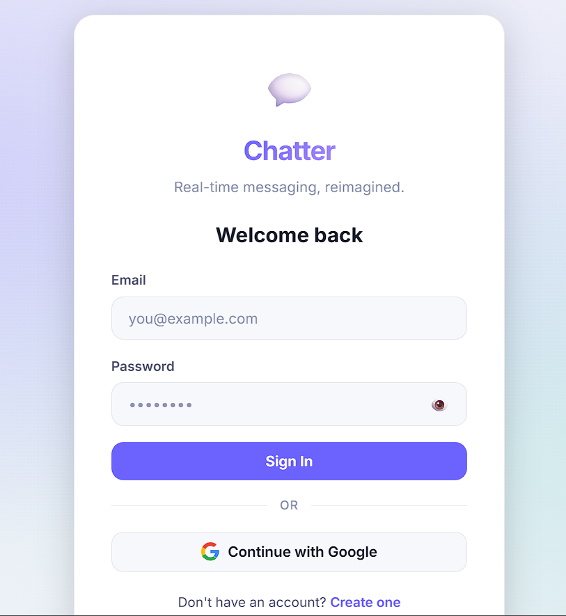
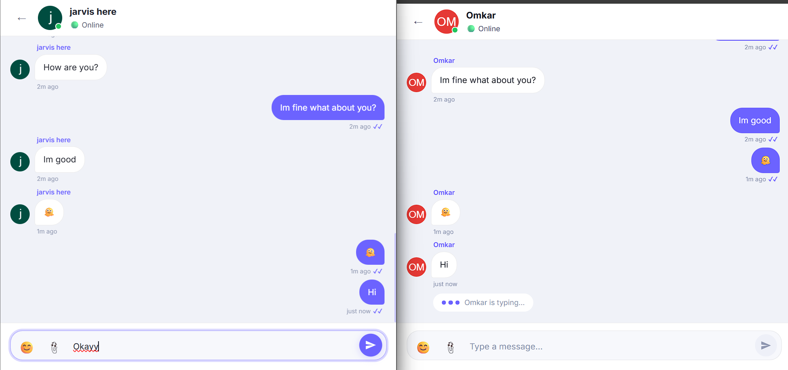

# 💬 WhatsApp Clone — Real-Time Chat Application

A modern real-time messaging app built with **React 18 + Vite** and **Firebase v10**. It supports authentication, direct and group chat, file/image uploads, typing indicators, and real-time presence.



## ✨ Features

- **Authentication**
  - Email/password login
  - Google OAuth
  - Persistent sessions
  - Protected routes
- **Real-time messaging**
  - Direct messages and group chats
  - Text, image, and file sending
  - Emoji picker and reactions
  - Reply to messages
- **Presence & notifications**
  - Online/offline status
  - Typing indicator
  - Unread message badges
- **Rich UI/UX**
  - Responsive design for desktop and mobile
  - Skeleton loading states
  - Clean chat interface with sidebar and profile panels



## 🚀 Quick Start

### 1. Clone the repository

```bash
git clone https://github.com/yahskamrahs/WhatsApp-Clone.git
cd "WhatsApp-Clone"
npm install
```

### 2. Create a Firebase project

- Go to the [Firebase Console](https://console.firebase.google.com/)
- Create a new project
- Enable these services:
  - **Authentication** → Email/Password, Google
  - **Firestore Database**
  - **Storage**
  - **Realtime Database**

### 3. Add Firebase config

Create a `.env` file at the project root and add your Firebase config values:

```env
VITE_FIREBASE_API_KEY=AIza...
VITE_FIREBASE_AUTH_DOMAIN=your-project.firebaseapp.com
VITE_FIREBASE_PROJECT_ID=your-project-id
VITE_FIREBASE_STORAGE_BUCKET=your-project.appspot.com
VITE_FIREBASE_MESSAGING_SENDER_ID=123456789
VITE_FIREBASE_APP_ID=1:123:web:abc
VITE_FIREBASE_DATABASE_URL=https://your-project-default-rtdb.firebaseio.com
```

### 4. Run the app locally

```bash
npm run dev
```

Open the app at `http://localhost:5173`

## Project Structure

- `src/firebase/` — Firebase initialization and helpers
- `src/context/` — Auth and chat state providers
- `src/hooks/` — Real-time data hooks for messages, presence, typing
- `src/components/` — UI components like chat window, sidebar, modals
- `src/pages/` — Auth, chat, profile, login, register screens
- `src/utils/` — Utility helpers

## Available Scripts

- `npm run dev` — Start the development server
- `npm run build` — Create a production build
- `npm run preview` — Preview the production build locally
- `npm run lint` — Run ESLint

## Dependencies

- `react`, `react-dom`, `vite`
- `firebase`
- `react-router-dom`
- `emoji-picker-react`
- `react-dropzone`
- `react-hot-toast`
- `zustand`
- `date-fns`

## Firebase Notes

- Firestore stores users, chats, and messages
- Realtime Database is used for online presence and typing state
- Storage handles image/file uploads

## Notes

- Use Firebase security rules to protect user data
- Only authenticated users should read/write chat records
- The app is designed for fast real-time interactions and responsive layouts
